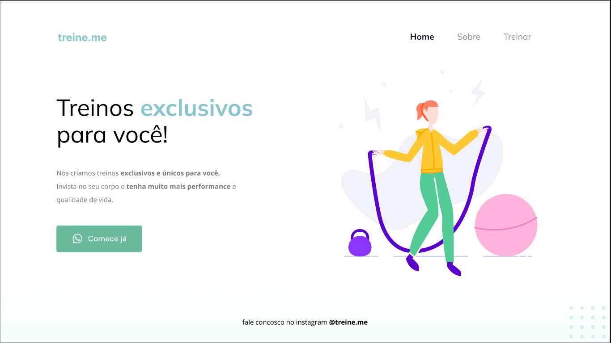

<h1 align="center">
  
</h1>

 

  

## 🚀 Tecnologias

Esse projeto foi desenvolvido com as seguintes tecnologias:

- HTML
- CSS

## 💻 Projeto

O Treine.me é uma tela de uma landpage para treinar os conceitos de CSS

## 🔖 Meta

Author - Rocketseat

programmer - [Fernando Futila] - fernando.futila@gmail.com

---
